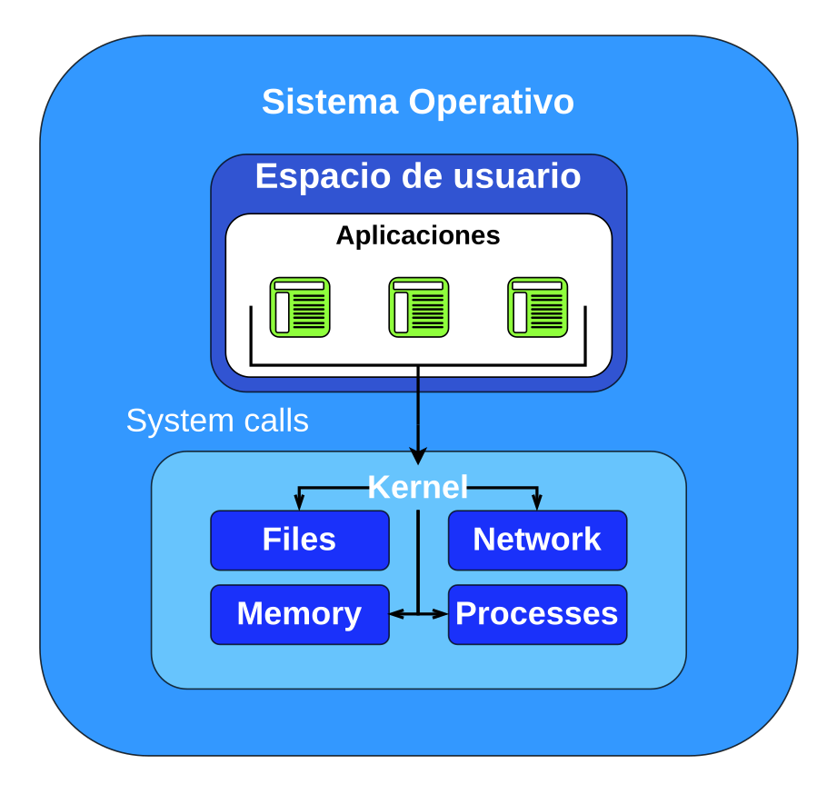

## Sobre este Artículo 

Este artículo fue creado originalmente como material de apoyo a los estudiantes
de ingeniería telemática para recordar conceptos básicos de sistemas operativos
y manejo a nivel inicial del sistema operativo Ubuntu Linux, ha sido adaptada
para una series de post

## Sistema Operativo y Kernel

El concepto de sistema operativo y kernel suele ser fácilmente
confundido, al referirnos a *Linux* solemnes hacerlo
indiscriminadamente, para hablar de un conjunto de sistemas operativos
que, como Debian, Ubuntu, Fedora, Centos, Open Suse, Arch Linux, y un
largo etcétera de sistemas operativos, ¿Y qué es un sistema operativo?
Su definición puede ser compleja debido a lo complejo que puede ser un
sistema operativo en sí mismo, y a la cantidad de responsabilidades que
puede llegar a tener el mismo.

Un sistema operativo se encarga de actuar como un intermediario entre el
usuario y el equipo de hardware, con el objetivo de facilitar la
resolución de problemas de los usuarios, el hardware que se diseña y se
construye para la solución de estos problemas, puede ser complejo en sí
mismo, un computador, un celular, un microcontrolador, debido a esta
complejidad, es necesario que exista una capa de software que actúe como
intermediario entre el usuario de un ordenador y el hardware del mismo.

Ahora bien, si el hardware que se construye para la solución de
diferentes problemas específicos, la construcción del sistema operativo
que se encargue de ser intermediario, también puede ser diferente, es
por esa razón que existen tantos sistemas operativos y las funciones
incluidas varían mucho de un sistema a otro. Algunos ocupan poco
espacio, como por ejemplo, alpinelinux, y pueden carecer de interfaz
gráfica, como las distribuciones server, o versiones basadas en Yocto,
mientras que otros requieren gigabytes de espacio, como Windows.

Una definición más simplificada de lo que es un sistema operativo, y
quizá más acertada, es que un sistema operativo está compuesto por un
único programa que se ejecuta en todo momento en el equipo de usuario,
ese programa es conocido como el **Kernel**.

Linux se refiere formalmente al kernel del sistema operativo, el kernel
es la capa de software entre las aplicaciones y el hardware sobre el
cual se ejecutan. Las aplicaciones se ejecutan en una capa sin
privilegios llamada espacio de usuario, que no puede acceder al hardware
directamente. En su lugar, una aplicación realiza peticiones utilizando
la interfaz de llamada al sistema (*syscall*) para solicitar al kernel
que actúe en su nombre. Ese acceso al hardware puede implicar leer y
escribir en archivos, enviar o recibir tráfico de red, o incluso
simplemente acceder a la memoria. El kernel también es responsable de
coordinar los procesos concurrentes, permitiendo que muchas aplicaciones
se ejecuten a la vez, la figura 1, muestra esta interacción.

> *Systemcalls* llamando al kernel adaptado de [^24]

Junto con el kernel, existen otros dos tipos de programas: los programas
de sistema, que están asociados al sistema operativo, pero no forman
parte necesariamente del kernel, y los programas de aplicación, que
incluyen todos los programas no asociados al funcionamiento del sistema,
es decir, el kernel es la capa que se encarga de interactuar con el
hardware, y el sistema operativo es un conjunto de aplicaciones, que
incluyen al kernel.

## Manejo de terminal

### Shell

El *shell* es un programa que tiene dos flujos: uno de entrada y otro de
salida. La entrada es un comando dado por el usuario, y la salida es el
resultado de ese comando, o una interpretación del mismo, el *shell*
principal en las principales distribuciones basadas en Linux se llama
Bash, no obstante, existen más *shells* disponibles en el sistema, para
validar la lista de *shells* disponibles se puede hacer de la siguiente
forma:

    $ cat /etc/shells
    # /etc/shells: valid login shells
    /bin/sh
    /usr/bin/sh
    /bin/bash
    /usr/bin/bash
    /bin/rbash
    /usr/bin/rbash
    /usr/bin/dash
    /usr/bin/screen
    /usr/bin/tmux

El comando [`cat`] es uno de los
comandos que nos ayuda a leer el contenido de un archivo.

La siguiente es una tabla de referencia de comandos que pueden ser
útiles para familiarizarse con Linux:

| **Comando**    |**Descripción**
|----------------|------------------------------------------------------------------------------------------
|             ls | lista los archivos de un *filesystem*
|             cd | moverse a un directorio especifico [`cd /usr`]
|             cp | copia un archivo de un *filesystem* a otro
|             mv | mueve un archivo de un *filesystem* a otro
|            pwd | muestra la ruta del *filesystem* actual
|          touch | crea un archivo de texto vacio
|           less | para abrir y navegar en un archivo (no podría editarse)
|           tail | para ver el contenido final de un archivo
|           head | para el contenido inicial de un archivo
|            cat | para mostrar todo el contenido de un archivo
|          mkdir | para crear un directorio
|             rm | para eliminar un archivo
|            man | para ver la documentación de un comando [`man ls`]
|           grep | para filtrar o buscar contenido dentro de un archivo
|           find | para buscar un archivo o directorio
|          which | para mostrar en que *filesystems* se encuentra un programa especifico
> Tabla de referencia de comando de *shell*

## Referencias

[^1]: El mejor editor de texto que existe en el mundo

[^2]: Donde el comando debe ser remplazado por
    [`:q`],
    [`:w`] o cualquiera otro
    comando

[^3]: El usuario podría sobreescribir estas teclas en el archivo de
    configuración

[^4]: Recuerde que este concepto es aplicable para sistemas operativos
    basados en *Unix*, en el caso de los sistemas operativos Windows, la
    estructura de organización es otra

[^5]: Usualmente, los archivos binarios de algunas aplicaciones ubicadas
    en el file system */usr/local/bin*, o en el */boot* pueden ser
    editados por un usuario administrador, caso contrario de los
    ubicados en */bin* los cuales al abrirlos con un editor de texto se
    ven como archivos binarios

[^6]: Recuerde que en sistemas basados en *Unix*, todo es un archivo.

[^7]: Por favor, no confundir este archivo con el kernel en sí mismo, el
    kernel de Linux usualmente está ubicado el */usr/src*

[^8]: Los *filesystems* que han sido marcados con un \*, pueden ser
    encontrados en el *root* no es porque sean diferentes, realmente son
    enlaces simbólicos a estos *filesystems*, por ejemplo */bin* es un
    enlace simbólico a */usr/bin*

[^9]: Este comando es lo que se conoce como un comando interactivo, es
    decir que necesita de la entrada de datos del usuario para completar
    su tarea, también existe el comando
    [`useradd`], que no es
    interactivo; [`adduser`] es un
    script que por debajo llama al comando
    [`useradd`]

[^10]: tambiém se podría agregar el usuario a los dos grupos al mismo
    tiempo, al párametro [`-G`] se
    le especifica una lista de grupos:
    [`sudo usermod -aG sudo,devops linus`]

[^11]: por favor, no intente eliminar el grupo de los suders

[^12]: Hacen referencia a dispositivos como teclados o mause

[^13]: Por defecto, todos los archivos que se crean tiene los permisos
    664

[^14]: El comando [`set`] muestra
    la lista completa con todas las definiciones

[^15]: En documentación y/o referencias podría encontrar que hacen
    referencia a un archivo llamado
    [`$HOME/.bash_profile`] , la
    diferencia entre este y el
    [`$HOME/.profile`] es el orden
    en el que el *shell* los consulta

[^16]: En administración de servidores o grupos, montados sobre Linux,
    podrá encontrar que existe un *filesystem* en */etc/skel* donde
    también hay un archivo
    [`.profile`], este
    *filesystem* es usado para crear plantillas de configuración para
    diferentes usuarios

[^17]: Esto podría ser una apreciación personal, probablemente todas las
    variables de entorno tengan la misma importancia o relevancia, pero
    para nuestro caso y el diseño de esta guía he decidido darle una
    importancia particular

[^18]: [`zypper`],
    [`emerge`],
    [`apk`],
    [`eopkg`],
    [`guix`],
    [`dnf`], todos estos son
    gestores de paquetes, de distribuciones distintas

[^19]: puede consultar la información de un paquete en
    <https://launchpad.net/ubuntu>

[^20]: La opción [`--purge`]
    también puede usar el comando
    [`sudo apt purge`]

[^21]: el repositorio de aplicaciones puede ser consultado en:
    <https://snapcraft.io/>

[^22]: En internet podrá encontrar que en vez de este comando sugieren
    el uso de [`ifconfig`], este
    comando ya no está instalado por defecto en Ubuntu, y ha sido
    marcado como deprecated, de cualquier forma puede seguir siendo
    usado si se instala el paquete
    [`net-tools`], principalmente
    porque este brinda otras herramientas de red que hoy por hoy siguen
    siendo utilizadas

[^23]: Entienda una *signal* como un mensaje que se le envia a un
    proceso, por ejemplo, un proceso hijo puede enviarle una señal a su
    *parent process* para indicarle que termino su tarea, o un proceso
    puede enviarle un mensaje a otro programa activo para solicitarle
    una información especifica

[^24]: Learning eBPF Programming the Linux Kernel for Enhanced Observability, Networking, and Security
